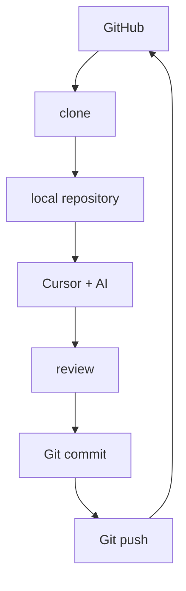
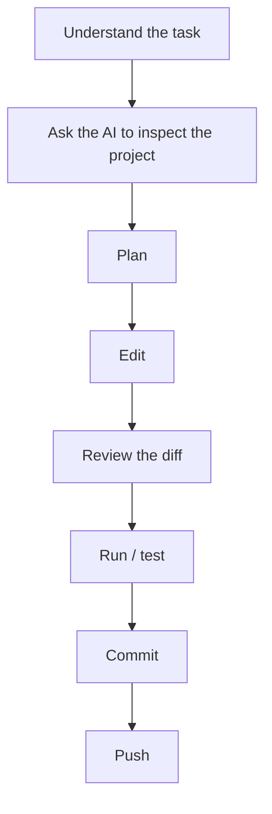
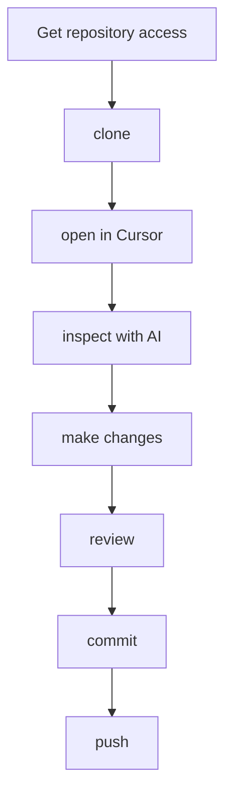

# AI-Assisted Coding Tutorial

This tutorial introduces a basic AI-assisted coding workflow using:

- **Cursor** — code editor and AI agent
- **Git** — version control on your computer
- **GitHub** — hosting and sharing Git repositories
- **GitHub CLI (`gh`)** — GitHub authentication and command-line tools
- **Agent Skills** — reusable instructions for AI agents

## What you will learn

By the end of the tutorial, you should be able to:

1. Set up Git, GitHub, and Cursor
2. Create your own copy of a GitHub repository
3. Clone the repository to your computer
4. Ask Cursor to inspect and modify a project
5. Review AI-generated changes
6. Commit and push your changes to GitHub
7. Use an Agent Skill

## Contents

- [AI-Assisted Coding Tutorial](#ai-assisted-coding-tutorial)
  - [What you will learn](#what-you-will-learn)
  - [Contents](#contents)
  - [1. Create a GitHub Account](#1-create-a-github-account)
  - [2. Install the Required Software](#2-install-the-required-software)
    - [macOS Setup](#macos-setup)
      - [Step 1 — Install Cursor](#step-1--install-cursor)
      - [Step 2 — Open Terminal](#step-2--open-terminal)
      - [Step 3 — Install Git](#step-3--install-git)
      - [Step 4 — Install Homebrew](#step-4--install-homebrew)
      - [Step 5 — Install GitHub CLI](#step-5--install-github-cli)
    - [Windows Setup](#windows-setup)
      - [Step 1 — Install Cursor](#step-1--install-cursor-1)
      - [Step 2 — Open PowerShell](#step-2--open-powershell)
      - [Step 3 — Check Windows Package Manager](#step-3--check-windows-package-manager)
      - [Step 4 — Install Git](#step-4--install-git)
      - [Step 5 — Install GitHub CLI](#step-5--install-github-cli-1)
  - [3. Configure Git](#3-configure-git)
  - [4. Connect Your Computer to GitHub](#4-connect-your-computer-to-github)
    - [Check your login](#check-your-login)
  - [5. Create Your Own Tutorial Repository](#5-create-your-own-tutorial-repository)
  - [6. Clone the Repository to Your Computer](#6-clone-the-repository-to-your-computer)
    - [Choose where to store your projects](#choose-where-to-store-your-projects)
    - [Clone](#clone)
    - [Check that Git is working](#check-that-git-is-working)
  - [7. Open the Project in Cursor](#7-open-the-project-in-cursor)
  - [8. Understand the Project with AI](#8-understand-the-project-with-ai)
  - [9. Run the Existing Program](#9-run-the-existing-program)
  - [10. Task 1 — Ask the AI to Modify the Code](#10-task-1--ask-the-ai-to-modify-the-code)
  - [11. Review the AI’s Changes](#11-review-the-ais-changes)
  - [12. Save the Change with Git](#12-save-the-change-with-git)
  - [13. Push the Change to GitHub](#13-push-the-change-to-github)
  - [14. Task 2 — Use an Agent Skill](#14-task-2--use-an-agent-skill)
    - [Try the skill](#try-the-skill)
  - [15. Optional Task — Let AI Implement Its Suggestion](#15-optional-task--let-ai-implement-its-suggestion)
  - [The Workflow to Remember](#the-workflow-to-remember)
  - [Quick Reference](#quick-reference)
  - [Troubleshooting](#troubleshooting)
    - [`git: command not found`](#git-command-not-found)
    - [`gh: command not found`](#gh-command-not-found)
    - [`brew: command not found` on macOS](#brew-command-not-found-on-macos)
    - [GitHub login is not working](#github-login-is-not-working)
    - [`python: command not found`](#python-command-not-found)
    - [I cannot access the course repository](#i-cannot-access-the-course-repository)
  - [After the Tutorial](#after-the-tutorial)

---

## 1. Create a GitHub Account

If you do not already have a GitHub account:

1. Go to [https://github.com](https://github.com)
2. Click **Sign up**
3. Create an account
4. Verify your email address
5. Remember your GitHub username

If you already have an account, simply make sure you can log in.

---

## 2. Install the Required Software

You will need:

- Cursor
- Git
- GitHub CLI (`gh`)

The setup is slightly different on macOS and Windows. Follow only the section for your operating system.

### macOS Setup

#### Step 1 — Install Cursor

Go to [https://cursor.com/download](https://cursor.com/download) and download the macOS version.

If you are unsure which version to choose, the **Universal** version should work.

After downloading:

1. Open the `.dmg` file
2. Drag Cursor into the Applications folder
3. Open Cursor
4. Sign in when prompted

#### Step 2 — Open Terminal

Press `Command (⌘) + Space`, search for **Terminal**, and open it.

#### Step 3 — Install Git

First check whether Git is already installed:

```bash
git --version
```

If you see something similar to `git version 2.x.x`, Git is already installed. Continue to the next step.

If Git is not installed, run:

```bash
xcode-select --install
```

A window will appear. Click **Install**.

After installation is complete, close and reopen Terminal. Check again:

```bash
git --version
```

#### Step 4 — Install Homebrew

Homebrew is a package manager that makes it easier to install command-line tools on macOS.

First check whether it is already installed:

```bash
brew --version
```

If a version number appears, skip to the next step.

Otherwise, go to [https://brew.sh](https://brew.sh), copy the installation command shown on the website, and run it in Terminal.

At the time of writing, it looks like:

```bash
/bin/bash -c "$(curl -fsSL https://raw.githubusercontent.com/Homebrew/install/HEAD/install.sh)"
```

During installation, you may be asked for your Mac password.

> **Note:** when entering a password in Terminal, no characters or `*****` will appear. This is normal.

At the end of the Homebrew installation, Terminal may display:

```text
==> Next steps:
```

followed by one or more commands. Copy and run the commands shown under **Next steps**.

Then check:

```bash
brew --version
```

#### Step 5 — Install GitHub CLI

Run:

```bash
brew install gh
```

Then check:

```bash
gh --version
```

You should see something similar to `gh version 2.x.x`.

Your macOS installation is now complete.

### Windows Setup

#### Step 1 — Install Cursor

Go to [https://cursor.com/download](https://cursor.com/download).

For most Windows computers, download **Windows x64**.

Run the downloaded installer and follow the instructions. Then:

1. Open Cursor
2. Sign in when prompted

#### Step 2 — Open PowerShell

Open the Start menu and search for **PowerShell**.

You can use either:

- Windows PowerShell
- Windows Terminal

#### Step 3 — Check Windows Package Manager

Run:

```powershell
winget --version
```

If you see a version number, continue.

#### Step 4 — Install Git

Run:

```powershell
winget install --id Git.Git -e --source winget
```

Follow any prompts. When installation is complete:

1. Close PowerShell completely
2. Open PowerShell again

Then run:

```powershell
git --version
```

You should see something similar to `git version 2.x.x.windows.x`.

#### Step 5 — Install GitHub CLI

Run:

```powershell
winget install --id GitHub.cli --source winget
```

When installation is complete:

1. Close PowerShell completely
2. Open PowerShell again

Then run:

```powershell
gh --version
```

You should see something similar to `gh version 2.x.x`.

Your Windows installation is now complete.

---

## 3. Configure Git

The remaining steps are the same on macOS and Windows.

Git records the author of each commit.

Set your name:

```bash
git config --global user.name "Your Name"
```

For example:

```bash
git config --global user.name "Alan Chan"
```

Then set your email:

```bash
git config --global user.email "your@email.com"
```

Preferably use an email address associated with your GitHub account.

Check your settings:

```bash
git config --global user.name
git config --global user.email
```

Note that your Git name does not need to be the same as your GitHub username.

---

## 4. Connect Your Computer to GitHub

We will use HTTPS, rather than SSH, for this tutorial.

Run:

```bash
gh auth login
```

Follow the prompts. Choose:

| Prompt | Choice |
| --- | --- |
| Where do you use GitHub? | **GitHub.com** |
| What is your preferred protocol for Git operations? | **HTTPS** |
| Authenticate Git with your GitHub credentials? | **Yes** (if asked) |
| How would you like to authenticate? | **Login with a web browser** |

GitHub CLI will display a one-time code such as `XXXX-XXXX`. Copy the code.

Press Enter to open GitHub in your browser. Then:

1. Log in to GitHub if necessary
2. Enter the one-time code
3. Authorize GitHub CLI

Return to Terminal or PowerShell.

### Check your login

Run:

```bash
gh auth status
```

You should see something similar to:

```text
Logged in to github.com account YOUR_USERNAME
Git operations for github.com configured to use https protocol
```

If you see this, your GitHub authentication is working.

---

## 5. Create Your Own Tutorial Repository

For this tutorial, we will use a template repository.

Open the tutorial repository in your browser. Click **Use this template**, then **Create a new repository**.

Choose your own GitHub account as the owner.

Give the repository a name such as `ai-coding-tutorial-yourname`. For example: `ai-coding-tutorial-alan`.

You may make the repository **Private**.

Click **Create repository**.

You now have your own copy of the tutorial project.

---

## 6. Clone the Repository to Your Computer

On your new GitHub repository page, click **Code** and copy the HTTPS repository URL.

It should look similar to:

```text
https://github.com/YOUR_USERNAME/ai-coding-tutorial-yourname.git
```

### Choose where to store your projects

For example, create a folder called `AI-Tutorial` inside your Documents folder.

**macOS** — in Terminal:

```bash
cd ~/Documents
mkdir AI-Tutorial
cd AI-Tutorial
```

**Windows** — in PowerShell:

```powershell
cd $HOME\Documents
mkdir AI-Tutorial
cd AI-Tutorial
```

### Clone

Run:

```bash
git clone YOUR_REPOSITORY_URL
```

For example:

```bash
git clone https://github.com/alan123/ai-coding-tutorial-alan.git
```

Then enter the repository:

```bash
cd ai-coding-tutorial-alan
```

The exact folder name will depend on the repository name you chose.

### Check that Git is working

Run:

```bash
git status
```

You should see something similar to:

```text
On branch main

nothing to commit, working tree clean
```

This means you successfully cloned the repository.

You can also run:

```bash
git remote -v
```

You should see your GitHub repository listed as `origin`.

---

## 7. Open the Project in Cursor

Open Cursor. Select **File → Open Folder**, then open the folder you just cloned.

You should see files similar to:

```text
README.md
analysis.py
data.csv
.cursor/
```

If Cursor asks whether you trust the files in the folder, select **Yes, I trust the authors**.

---

## 8. Understand the Project with AI

Before asking AI to modify code, ask it to understand the project.

Open the Cursor Agent/Chat panel. Enter:

```text
Inspect this repository.

Do not make any changes yet.

Explain:

1. What this project does
2. What each important file is used for
3. How the program works
4. How I can run it
```

Read the response.

Do not blindly assume that the AI is correct. Compare its explanation with the actual files in the project.

---

## 9. Run the Existing Program

Open Cursor’s integrated terminal. Run:

```bash
python analysis.py
```

Depending on your computer, you may instead need:

```bash
python3 analysis.py
```

The existing program should read `data.csv` and report the mean score. For example:

```text
Mean score: 78.0
```

---

## 10. Task 1 — Ask the AI to Modify the Code

The current program only reports the mean.

Your first task is to extend it. Ask Cursor:

```text
Modify the program so that it also reports:

- the median score
- the minimum score
- the maximum score

Before editing, inspect the relevant files and briefly explain what you plan to change.

After editing, run the program and verify that it works.
```

Allow Cursor to make the changes.

---

## 11. Review the AI’s Changes

AI-generated code should always be reviewed.

Do not automatically accept everything simply because the program runs.

Check:

- Which files were modified?
- What code was added?
- Does the change make sense?
- Did the AI modify anything unnecessary?
- Does the program still work?

In the terminal, run:

```bash
git status
```

You should see that `analysis.py` has been modified.

Then run:

```bash
git diff
```

This shows the exact difference between the original version and the current version.

Run the program again:

```bash
python analysis.py
```

or:

```bash
python3 analysis.py
```

Check that the output contains:

```text
Mean score
Median score
Minimum score
Maximum score
```

---

## 12. Save the Change with Git

Git allows us to save a checkpoint of our work.

First check:

```bash
git status
```

Then stage the modified file:

```bash
git add analysis.py
```

Check again:

```bash
git status
```

Now create a commit:

```bash
git commit -m "Add summary statistics"
```

A commit is a named checkpoint in the history of your project.

---

## 13. Push the Change to GitHub

Your commit currently exists on your computer.

Send it to GitHub:

```bash
git push
```

Open your repository on GitHub and refresh the page.

You should now see your new commit.

You have completed the basic workflow:



---

## 14. Task 2 — Use an Agent Skill

This repository contains an example Agent Skill.

Look inside:

```text
.cursor/
└── skills/
    └── analyze-data/
        └── SKILL.md
```

Open `SKILL.md` and read it.

A Skill contains reusable instructions that tell an AI agent how to perform a particular type of task.

A useful way to think about the difference is:

| | |
| --- | --- |
| **Prompt** | What do I want the AI to do now? |
| **Skill** | How should the AI normally perform this type of task? |

### Try the skill

Ask Cursor:

```text
Use the analyze-data skill to inspect data.csv.

Follow the skill instructions and suggest one useful extension to the current analysis.

Do not modify the code yet.
```

Compare this response with a generic request such as:

```text
Analyze data.csv.
```

Think about:

- Is the response more structured?
- Did the AI follow the workflow described in the Skill?
- Why might reusable Skills be useful in a larger project?

---

## 15. Optional Task — Let AI Implement Its Suggestion

If time permits, choose one useful extension suggested by the AI.

For example:

```text
Implement the suggested extension.

Make the smallest reasonable change.

Run the program after editing and verify that it works.
```

Then repeat the workflow:

```bash
git status
git diff
```

Review the change.

If you are satisfied:

```bash
git add .
git commit -m "Extend data analysis"
git push
```

---

## The Workflow to Remember

The purpose of this tutorial is not to memorize Git commands.

The important workflow is:



AI can help you work faster, but you remain responsible for understanding and reviewing the changes.

---

## Quick Reference

| Goal | Command |
| --- | --- |
| Check installation | `git --version` / `gh --version` |
| Check GitHub login | `gh auth status` |
| Check repository status | `git status` |
| See exactly what changed | `git diff` |
| Save a checkpoint | `git add .` then `git commit -m "Describe your change"` |
| Upload commits to GitHub | `git push` |
| Get new changes from GitHub | `git pull` |

---

## Troubleshooting

### `git: command not found`

Git is not installed correctly.

Return to the Git installation section above.

After installing Git, close and reopen Terminal or PowerShell.

### `gh: command not found`

GitHub CLI is not installed correctly.

Return to the GitHub CLI installation section.

After installing it, close and reopen Terminal or PowerShell.

### `brew: command not found` on macOS

Homebrew may have installed successfully but may not yet be in your shell PATH.

Look at the final output from the Homebrew installer and run the commands shown under **Next steps**.

Then close and reopen Terminal.

### GitHub login is not working

Run:

```bash
gh auth status
```

If you are not logged in, run `gh auth login` again.

Choose **GitHub.com**, **HTTPS**, and **Login with a web browser**.

### `python: command not found`

On macOS, try:

```bash
python3 analysis.py
```

instead.

### I cannot access the course repository

First try opening the repository in your web browser while logged into GitHub.

If you cannot see it in your browser, this is probably a repository permission issue, not a Git or Cursor problem.

The practice repository used in this tutorial does not require access to the main course repository.

---

## After the Tutorial

Once access to the main course repository is available, the same workflow applies:



The tools may change over time, but this basic workflow is transferable to other AI coding environments as well.
