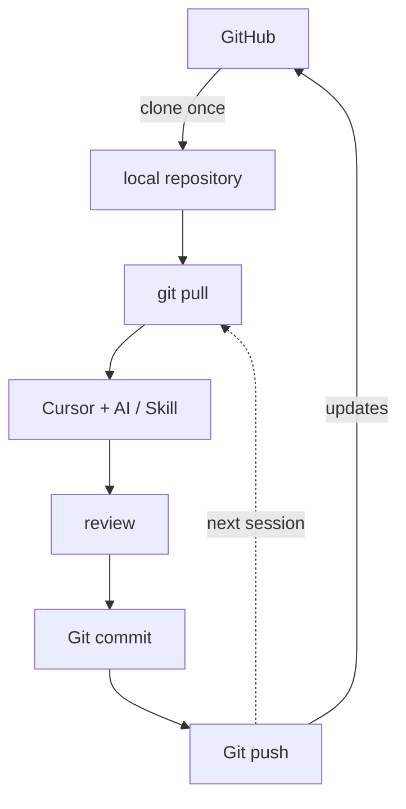
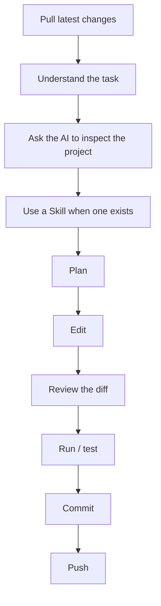
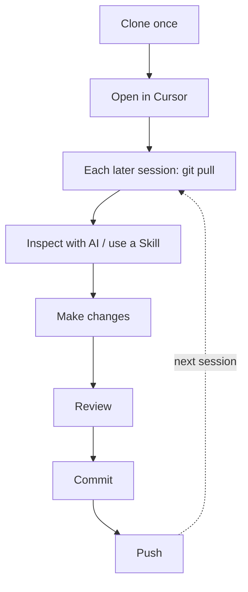

# AI-Assisted Coding Tutorial

This tutorial introduces a basic AI-assisted coding workflow using:

- **Cursor** — code editor and AI agent
- **Git** — version control on your computer
- **GitHub** — hosting and sharing Git repositories
- **GitHub CLI (`gh`)** — GitHub authentication and command-line tools
- **Agent Skills** — reusable instructions for AI agents

## What you will learn

By the end of the tutorial, you should be able to:

1. Set up Git, GitHub, Cursor, and Python
2. Clone this repository once to a folder on your Desktop
3. Pull updates before you start work on a later day (do not clone again)
4. Ask Cursor to inspect and modify a project
5. Review AI-generated changes
6. Use an Agent Skill
7. Commit and push your changes to GitHub

## Contents

- [AI-Assisted Coding Tutorial](#ai-assisted-coding-tutorial)
  - [What you will learn](#what-you-will-learn)
  - [Contents](#contents)
  - [1. Create a GitHub Account](#1-create-a-github-account)
  - [2. Install the Required Software](#2-install-the-required-software)
    - [macOS Setup](#macos-setup)
      - [Step 1 — Install Cursor](#step-1--install-cursor)
      - [Step 2 — Open Terminal](#step-2--open-terminal)
      - [Step 3 — Install Git](#step-3--install-git)
      - [Step 4 — Install Homebrew](#step-4--install-homebrew)
      - [Step 5 — Install GitHub CLI](#step-5--install-github-cli)
    - [Windows Setup](#windows-setup)
      - [Step 1 — Install Cursor](#step-1--install-cursor-1)
      - [Step 2 — Open PowerShell](#step-2--open-powershell)
      - [Step 3 — Check Windows Package Manager](#step-3--check-windows-package-manager)
      - [Step 4 — Install Git](#step-4--install-git)
      - [Step 5 — Install GitHub CLI](#step-5--install-github-cli-1)
  - [3. Configure Git](#3-configure-git)
  - [4. Connect Your Computer to GitHub](#4-connect-your-computer-to-github)
    - [Check your login](#check-your-login)
  - [5. Clone the Repository to Your Computer](#5-clone-the-repository-to-your-computer)
    - [Go to your Desktop](#go-to-your-desktop)
    - [Create a course folder](#create-a-course-folder)
    - [Clone](#clone)
    - [Check that Git is working](#check-that-git-is-working)
  - [6. Open the Project in Cursor](#6-open-the-project-in-cursor)
  - [7. Understand the Project with AI](#7-understand-the-project-with-ai)
  - [8. Run the Existing Program](#8-run-the-existing-program)
  - [9. Always Pull Before Making Changes](#9-always-pull-before-making-changes)
  - [10. Task 1 — Ask the AI to Modify the Code](#10-task-1--ask-the-ai-to-modify-the-code)
  - [11. Review the AI’s Changes](#11-review-the-ais-changes)
  - [12. Save the Change with Git](#12-save-the-change-with-git)
  - [13. Task 2 — Use an Agent Skill](#13-task-2--use-an-agent-skill)
    - [Try the skill](#try-the-skill)
  - [14. Push the Change to GitHub](#14-push-the-change-to-github)
  - [15. Optional Task — Let AI Implement Its Suggestion](#15-optional-task--let-ai-implement-its-suggestion)
  - [The Workflow to Remember](#the-workflow-to-remember)
  - [Quick Reference](#quick-reference)
  - [Troubleshooting](#troubleshooting)
    - [`git: command not found`](#git-command-not-found)
    - [`gh: command not found`](#gh-command-not-found)
    - [`brew: command not found` on macOS](#brew-command-not-found-on-macos)
    - [GitHub login is not working](#github-login-is-not-working)
    - [`python: command not found`](#python-command-not-found)
    - [I cannot clone or access the repository](#i-cannot-clone-or-access-the-repository)
  - [After the Tutorial](#after-the-tutorial)

---

## 1. Create a GitHub Account

If you do not already have a GitHub account:

1. Go to [https://github.com](https://github.com)
2. Click **Sign up**
3. Create an account
4. Verify your email address
5. Remember your GitHub username

If you already have an account, simply make sure you can log in.

---

## 2. Install the Required Software

You will need:

- Cursor
- Git
- GitHub CLI (`gh`)
- Python 3 (to run `analysis.py`)

The setup is slightly different on macOS and Windows. Follow only the section for your operating system.

### macOS Setup

#### Step 1 — Install Cursor

Go to [https://cursor.com/download](https://cursor.com/download) and download the macOS version.

If you are unsure which version to choose, the **Universal** version should work.

After downloading:

1. Open the `.dmg` file
2. Drag Cursor into the Applications folder
3. Open Cursor
4. Sign in when prompted

#### Step 2 — Open Terminal

Press `Command (⌘) + Space`, search for **Terminal**, and open it.

#### Step 3 — Install Git

First check whether Git is already installed:

```bash
git --version
```

If you see something similar to `git version 2.x.x`, Git is already installed. Continue to the next step.

If Git is not installed, run:

```bash
xcode-select --install
```

A window will appear. Click **Install**.

After installation is complete, close and reopen Terminal. Check again:

```bash
git --version
```

#### Step 4 — Install Homebrew

Homebrew is a package manager that makes it easier to install command-line tools on macOS.

First check whether it is already installed:

```bash
brew --version
```

If a version number appears, skip to the next step.

Otherwise, go to [https://brew.sh](https://brew.sh), copy the installation command shown on the website, and run it in Terminal.

At the time of writing, it looks like:

```bash
/bin/bash -c "$(curl -fsSL https://raw.githubusercontent.com/Homebrew/install/HEAD/install.sh)"
```

During installation, you may be asked for your Mac password.

> **Note:** when entering a password in Terminal, no characters or `*****` will appear. This is normal.

At the end of the Homebrew installation, Terminal may display:

```text
==> Next steps:
```

followed by one or more commands. Copy and run the commands shown under **Next steps**.

Then check:

```bash
brew --version
```

#### Step 5 — Install GitHub CLI

Run:

```bash
brew install gh
```

Then check:

```bash
gh --version
```

You should see something similar to `gh version 2.x.x`.

Your macOS installation is now complete.

### Windows Setup

#### Step 1 — Install Cursor

Go to [https://cursor.com/download](https://cursor.com/download).

For most Windows computers, download **Windows x64**.

Run the downloaded installer and follow the instructions. Then:

1. Open Cursor
2. Sign in when prompted

#### Step 2 — Open PowerShell

Open the Start menu and search for **PowerShell**.

You can use either:

- Windows PowerShell
- Windows Terminal

#### Step 3 — Check Windows Package Manager

Run:

```powershell
winget --version
```

If you see a version number, continue.

If the command is not found, install **App Installer** from the Microsoft Store, then close and reopen PowerShell.

#### Step 4 — Install Git

Run:

```powershell
winget install --id Git.Git -e --source winget
```

Follow any prompts. When installation is complete:

1. Close PowerShell completely
2. Open PowerShell again

Then run:

```powershell
git --version
```

You should see something similar to `git version 2.x.x.windows.x`.

#### Step 5 — Install GitHub CLI

Run:

```powershell
winget install --id GitHub.cli --source winget
```

When installation is complete:

1. Close PowerShell completely
2. Open PowerShell again

Then run:

```powershell
gh --version
```

You should see something similar to `gh version 2.x.x`.

Your Windows installation is now complete.

---

## 3. Configure Git

The remaining steps are the same on macOS and Windows.

Git records the author of each commit.

Set your name:

```bash
git config --global user.name "Your Name"
```

For example:

```bash
git config --global user.name "Alan Chan"
```

Then set your email:

```bash
git config --global user.email "your@email.com"
```

Preferably use an email address associated with your GitHub account.

Check your settings:

```bash
git config --global user.name
git config --global user.email
```

Note that your Git name does not need to be the same as your GitHub username.

---

## 4. Connect Your Computer to GitHub

We will use HTTPS, rather than SSH, for this tutorial.

Run:

```bash
gh auth login
```

Follow the prompts. Choose:

| Prompt | Choice |
| --- | --- |
| Where do you use GitHub? | **GitHub.com** |
| What is your preferred protocol for Git operations? | **HTTPS** |
| Authenticate Git with your GitHub credentials? | **Yes** (if asked) |
| How would you like to authenticate? | **Login with a web browser** |

GitHub CLI will display a one-time code such as `XXXX-XXXX`. Copy the code.

Press Enter to open GitHub in your browser. Then:

1. Log in to GitHub if necessary
2. Enter the one-time code
3. Authorize GitHub CLI

Return to Terminal or PowerShell.

### Check your login

Run:

```bash
gh auth status
```

You should see something similar to:

```text
Logged in to github.com account YOUR_USERNAME
Git operations for github.com configured to use https protocol
```

If you see this, your GitHub authentication is working.

---

## 5. Clone the Repository to Your Computer

You will download a copy of this course repository:

```text
https://github.com/IpWangHei/environmentsetup.git
```

A convenient place to keep course files is a folder on your **Desktop**, so you can find it in Finder or File Explorer without hunting through nested directories.

### Go to your Desktop

In the terminal, `cd` means “change directory.” `~` means your home folder. Desktop lives directly under that home folder, so this is a short, reliable way to get there.

**macOS** — in Terminal:

```bash
cd ~/Desktop
```

**Windows** — in PowerShell:

```powershell
cd $HOME\Desktop
```

To confirm you are in the right place, run `pwd`. The path should end with `Desktop`.

### Create a course folder

Create a folder named `ECON3334` on the Desktop, then enter it.

**macOS:**

```bash
mkdir ECON3334
cd ECON3334
```

**Windows:**

```powershell
mkdir ECON3334
cd ECON3334
```

If the folder already exists, skip `mkdir` and only run `cd ECON3334`.

You should now see an `ECON3334` folder on your Desktop. Later course materials can go in the same folder.

### Clone

Still inside `ECON3334`, run:

```bash
git clone https://github.com/IpWangHei/environmentsetup.git
```

This creates a folder named `environmentsetup`. Enter it:

```bash
cd environmentsetup
```

### Check that Git is working

Run:

```bash
git status
```

You should see something similar to:

```text
On branch main

nothing to commit, working tree clean
```

This means you successfully cloned the repository.

You can also run:

```bash
git remote -v
```

You should see `https://github.com/IpWangHei/environmentsetup.git` listed as `origin`.

You only need to clone once. After this, that folder is your local copy. To get later updates from GitHub, use `git pull`. To upload your own commits, use `git push`. Do not run `git clone` again in the same folder.

---

## 6. Open the Project in Cursor

Open Cursor. Select **File → Open Folder**, then open the folder you just cloned.

On the Desktop, that folder is:

```text
ECON3334 / environmentsetup
```

You should see files similar to:

```text
README.md
analysis.py
data.csv
requirements.txt
.cursor/
```

If Cursor asks whether you trust the files in the folder, select **Yes, I trust the authors**.

---

## 7. Understand the Project with AI

Before asking AI to modify code, ask it to understand the project.

Open the Cursor Agent/Chat panel. Enter:

```text
Inspect this repository.

Do not make any changes yet.

Explain:

1. What this project does
2. What each important file is used for
3. How the program works
4. How I can run it
```

Read the response.

Do not blindly assume that the AI is correct. Compare its explanation with the actual files in the project.

---

## 8. Run the Existing Program

This program needs Python 3. In Cursor’s integrated terminal, check:

```bash
python3 --version
```

On some Windows computers, use:

```powershell
python --version
```

You should see a version such as `Python 3.x.x`. If Python is missing, install it from [https://www.python.org/downloads/](https://www.python.org/downloads/). On Windows, tick **Add python.exe to PATH** during setup, then close and reopen the terminal.

Then run. On macOS, prefer `python3`. On Windows, prefer `python`.

```bash
python3 analysis.py
```

or:

```bash
python analysis.py
```

The existing program should read `data.csv` and report the mean score. For example:

```text
Mean score: 78.0
```

---

## 9. Always Pull Before Making Changes

This repository is shared. The instructor may update files after you clone it.

**When you return to this project on a later day, pull first** — before you edit files, and before you ask Cursor to change anything. Do not clone the repository again.

In the project folder, run:

```bash
git pull
```

`git pull` downloads new commits from GitHub and updates your existing folder.

After a fresh clone, this will usually print `Already up to date.` That is expected. Practise the command now so you remember it for later sessions.

If there are updates, Git will apply them. Read the list of changed files so you know what is new.

If `git pull` reports a conflict, stop and ask for help before continuing. Do not ask the AI to “just fix it” until you understand what overlapped.

You will practise pushing later in this tutorial, after you have used an Agent Skill.

---

## 10. Task 1 — Ask the AI to Modify the Code

First pull, if you have not already:

```bash
git pull
```

The current program only reports the mean.

Your first task is to extend it. Ask Cursor:

```text
Modify the program so that it also reports:

- the median score
- the minimum score
- the maximum score

Before editing, inspect the relevant files and briefly explain what you plan to change.

After editing, run the program and verify that it works.
```

Allow Cursor to make the changes.

---

## 11. Review the AI’s Changes

AI-generated code should always be reviewed.

Do not automatically accept everything simply because the program runs.

Check:

- Which files were modified?
- What code was added?
- Does the change make sense?
- Did the AI modify anything unnecessary?
- Does the program still work?

In the terminal, run:

```bash
git status
```

You should see that `analysis.py` has been modified.

Then run:

```bash
git diff
```

This shows the exact difference between the original version and the current version.

Run the program again:

```bash
python analysis.py
```

or:

```bash
python3 analysis.py
```

Check that the output contains:

```text
Mean score
Median score
Minimum score
Maximum score
```

---

## 12. Save the Change with Git

Git allows us to save a checkpoint of our work on your computer.

First check:

```bash
git status
```

Then stage the modified file:

```bash
git add analysis.py
```

Check again:

```bash
git status
```

Now create a commit:

```bash
git commit -m "Add summary statistics"
```

A commit is a named checkpoint in the history of your project.

Leave it on your computer for now. You will push after the skill task.

---

## 13. Task 2 — Use an Agent Skill

This is the more important part of the tutorial.

A Skill contains reusable instructions that tell an AI agent how to perform a particular type of task. Once a skill exists in the project, you can ask Cursor to follow it instead of rewriting a long prompt every time.

Look inside:

```text
.cursor/
└── skills/
    └── analyze-data/
        └── SKILL.md
```

Open `SKILL.md` and read it.

A useful way to think about the difference is:

| Term | Meaning |
| --- | --- |
| **Prompt** | What do I want the AI to do now? |
| **Skill** | How should the AI normally perform this type of task? |

### Try the skill

In the chat box, mention the skill by name. You can also explicitly call `analyze-data` skill with `/`. Then ask:

```text
Use the analyze-data skill to inspect data.csv.
```

Compare this response with a generic request such as:

```text
Analyze data.csv.
```

Think about:

- Is the response more structured?
- Did the AI follow the workflow described in the Skill?
- Why might reusable Skills be useful in a larger project?

Remark: Usually the AI will automatically apply the skill when it thinks suitable.

---

## 14. Push the Change to GitHub

Your earlier commit currently exists only on your computer.

Send it to GitHub:

```bash
git push
```

If the push succeeds, open the repository on GitHub and refresh the page. You should see your new commit.

This shared course repository may reject the push if you do not have write access. That is expected. You have still learned the command. Later, when you work in a repository you own, `git push` is how you upload commits.

You have now completed the basic Git workflow. **Clone only once.** After that, GitHub stays in sync with `git pull` and `git push`. Do not clone the repository again each time you work.



---

## 15. Optional Task — Let AI Implement Its Suggestion

If time permits, choose one useful extension suggested by the AI.

For example:

```text
Implement the suggested extension.

Make the smallest reasonable change.

Run the program after editing and verify that it works.
```

Then review:

```bash
git status
git diff
```

If you are satisfied:

```bash
git add .
git commit -m "Extend data analysis"
git push
```

Skip `git push` if this repository rejected it earlier.

---

## The Workflow to Remember

The purpose of this tutorial is not to memorize Git commands.

The important workflow is:



AI can help you work faster, but you remain responsible for understanding and reviewing the changes.

Clone once. Pull when you come back to the project. Prefer a Skill over a one-off prompt when the project already has one. Push after you have reviewed and committed.

---

## Quick Reference

| Goal | Command |
| --- | --- |
| Go to Desktop | `cd ~/Desktop` (macOS) / `cd $HOME\Desktop` (Windows) |
| Check installation | `git --version` / `gh --version` |
| Check GitHub login | `gh auth status` |
| Clone this repository (once) | `git clone https://github.com/IpWangHei/environmentsetup.git` |
| Get new changes from GitHub | `git pull` — when you return, before you make changes |
| Check repository status | `git status` |
| See exactly what changed | `git diff` |
| Save a local checkpoint | `git add .` then `git commit -m "Describe your change"` |
| Upload commits to GitHub | `git push` |

---

## Troubleshooting

You always want to ask AI for technical problems since it has access to your computer and can directly figure out the root of the problems. Be specific.

### `git: command not found`

Git is not installed correctly.

Return to the Git installation section above.

After installing Git, close and reopen Terminal or PowerShell.

### `gh: command not found`

GitHub CLI is not installed correctly.

Return to the GitHub CLI installation section.

After installing it, close and reopen Terminal or PowerShell.

### `brew: command not found` on macOS

Homebrew may have installed successfully but may not yet be in your shell PATH.

Look at the final output from the Homebrew installer and run the commands shown under **Next steps**.

Then close and reopen Terminal.

### GitHub login is not working

Run:

```bash
gh auth status
```

If you are not logged in, run `gh auth login` again.

Choose **GitHub.com**, **HTTPS**, and **Login with a web browser**.

### `python: command not found`

On macOS, try `python3 analysis.py`.

On Windows, try `python analysis.py`. If that also fails, install Python from [python.org](https://www.python.org/downloads/) and tick **Add python.exe to PATH**.

### I cannot clone or access the repository

First try opening [https://github.com/IpWangHei/environmentsetup](https://github.com/IpWangHei/environmentsetup) in your web browser while logged into GitHub.

If you cannot see it in your browser, this is probably a repository permission issue, not a Git or Cursor problem.

If `git clone` says the folder already exists, enter the existing `environmentsetup` folder. You do not need to clone again.

If `git pull` asks you to commit or stash local changes first, you have uncommitted edits. Commit them locally, or copy your work elsewhere, before pulling.

If `git push` is rejected, you probably do not have write access to this shared repository. That is expected here. Use `git push` later on a repository you own.

---

## After the Tutorial

Later course work will use the same pattern: **clone once**. Each later session, open the project, **pull**, then work. Use Skills when they are provided.



The tools may change over time, but this basic workflow is transferable to other AI coding environments as well.
